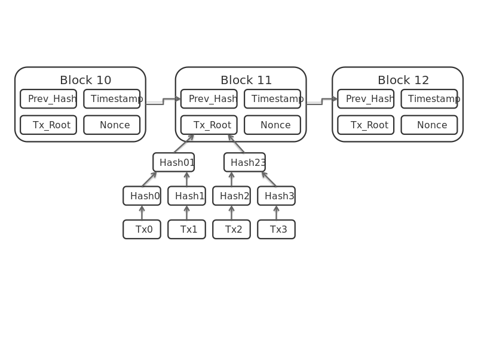

# Basic Blockchain implementation in Node

### Research

### Reference

https://en.wikipedia.org/wiki/Blockchain

https://lhartikk.github.io/

https://en.wikipedia.org/wiki/Merkle_tree

https://github.com/izqui/blockchain

https://github.com/itheima1/BlockChain

https://github.com/dvf/blockchain

https://github.com/LiuBoyu/blockchain
